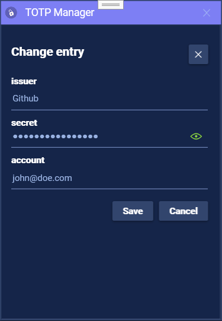
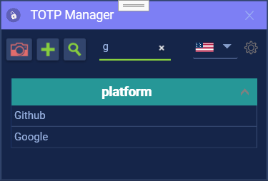

# TOTP Manager

TOTP Manager is a Windows desktop app (WPF) for managing and generating `Time-based One-Time Passwords (TOTP)`  locally.

## Table of Contents

- [Scope](#scope)
- [Screenshots](#screenshots)
- [TOTP Defaults](#totp-defaults)
- [Account Management (CRUD + QR)](#account-management-crud--qr)
- [Core Security Design](#core-security-design)
- [Features](#features)
- [Requirements](#requirements)
- [Build](#build)
- [Test](#test)
- [Run (Local)](#run-local)
- [Release Installation](#release-installation)
- [Backup and Recovery Notes](#backup-and-recovery-notes)
- [Contributing](#contributing)
- [Licensing](#licensing)
- [Support](#support)


## Scope

- Local account storage and code generation
- Import/export workflows for backup and migration
- Authorization flows based on master password and optional Windows Hello support

## Screenshots

<table>
  <tr>
    <td align="center" width="33%">
      <br/>
      <b>Main List View</b><br/>
      <sub>Account grid before selecting an entry.</sub>
    </td>
   <td align="center" width="33%">
      <br/>
      <b>Active OTP</b><br/>
      <sub>Selected account with generated code and countdown ring.</sub>
    </td>
    <td align="center" width="33%">
      <br/>
      <b>Inline QR Generation</b><br/>
      <sub>Gerated QR code can be scanned by mobile devices for quick account transfers.</sub>
    </td>
  </tr>
  <tr>
    <td align="center" width="33%">
      <br/>
      <b>Edit Account</b><br/>
      <sub>Flyout for updating platform, secret, and account fields.</sub>
    </td>
      <td align="center" width="33%">
      <br/>
      <b>Focused Search Result</b><br/>
      <sub>Filtered account list with an active OTP and quick QR action.</sub>
    </td>
   
    <td align="center" width="33%">
      <br/>
      <b>QR Preview Overlay</b><br/>
      <sub>Enlarged QR view for easier scanning on another device.</sub>
    </td>
  </tr>
</table>

## TOTP Defaults

- Algorithm: `SHA1`
- Digits: `6`
- Time step (period): `30` seconds

These defaults are used for generated `otpauth://` QR data and for standard TOTP code generation in the app.

See also:
- [THREAT_MODEL.md](docs/security/THREAT_MODEL.md)
- [SECURITY_VERIFICATION.md](docs/security/SECURITY_VERIFICATION.md)
- [PENTEST_PLAN.md](docs/security/PENTEST_PLAN.md)

## Account Management (CRUD + QR)

These are the primary workflows in the app.

### Create account

1. Click the `+` button or press `Ctrl + A`.
2. Enter issuer, account label, secret, digits, and period.
3. Save to create the account.

### Select account

1. Open the main account list.
2. Click an account entry to view current code and metadata.
3. The OTP code is copied to the clipboard immediately when you click an account entry.
4. The OTP code is also copied immediately when you click the generated OTP code itself.
5. Use search to quickly filter by issuer/account.

### Update account

1. Select an account.
2. Right-click the row and choose `Edit` for full edit.
3. For quick inline edit, double-click the row to edit only the issuer name.
4. Save changes.

### Delete account

1. Select an account.
2. Right-click the row and choose `Delete`.
3. Confirm removal.

### Generate QR code from account

1. Select an existing account.
2. Click "Show QR code".
3. The app generates a QR code from the account's OTP configuration.
4. Click the QR code in order to enlarge it.

### Scan QR code to add TOTP

1. Click the camera symbol.
2. The camera activates and is ready to scan.
3. Scan the `otpauth://` QR code from the provider.
4. Review parsed account details and save.

## Core Security Design

- Secrets are encrypted before they are written to disk
- Password-derived key material uses Argon2id
- Additional local protection uses Windows DPAPI
- Sensitive actions require explicit authorization

## Features

- Secure local vault for accounts
- Create, edit, and delete TOTP accounts
- Generate rotating 6-digit TOTP codes
- Search and manage accounts in the main grid
- Encrypted export/import for backups (`.totp`)
- Backup rotation support
- Localization resources (English/German)

## Requirements

- Windows 10/11
- .NET 9 SDK (for local build/test)

## Build

```powershell
dotnet restore TOTP.sln
dotnet build TOTP.sln -c Debug
```

## Test

```powershell
dotnet test TOTP.sln -c Debug
```

## Run (Local)

```powershell
dotnet run --project .\TOTP\TOTP.UI.WPF.csproj
```

## Release Installation

1. Download the latest release archive from GitHub.
2. Extract it to a local folder.
3. Start `TOTP.UI.WPF.exe`.
4. Complete first-run security setup.

## Backup and Recovery Notes

- Keep encrypted backups in a protected location
- Validate restore procedure regularly
- Keep master password and Windows account recovery options available

## Contributing

See `CONTRIBUTING.md` for contribution and workflow details.

## Licensing

- Project license: [LICENSE.txt](LICENSE.txt)
- Third-party notices: [THIRD_PARTY_NOTICES.md](THIRD_PARTY_NOTICES.md)

## Support

- Bugs and feature requests: GitHub Issues
- Security topics: follow the repository security process/documentation
