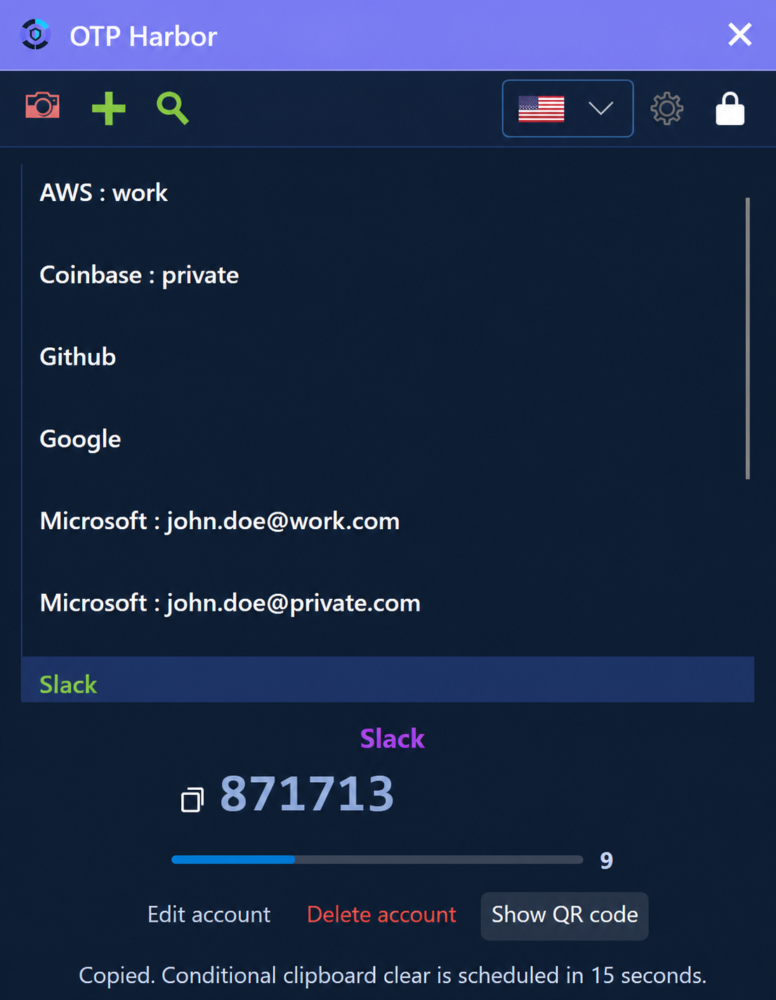

# TOTP Manager

[](https://github.com/Legends/TOTP-Manager)
[](https://dotnet.microsoft.com/download/dotnet/9.0)
[](https://github.com/Legends/TOTP-Manager/actions/workflows/build-and-test.yml)
[](https://github.com/Legends/TOTP-Manager/actions/workflows/security-audit.yml)
[](https://github.com/Legends/TOTP-Manager/releases/latest)
[](LICENSE.txt)

TOTP Manager is a local-first desktop authenticator with an encrypted vault, optional platform quick unlock, QR workflows, protected backup and restore, and verified update metadata. It does not require a cloud account.

> **Release status:** `v2.0.0` is in release-candidate testing. RC packages are unsigned Windows/Linux previews with automatic updates disabled. Use synthetic accounts and keep a tested encrypted backup.

<p align="center">
  
</p>

## Features

- AES-256-GCM encrypted local vault with Argon2id password derivation
- Windows Hello and macOS quick unlock with master-password recovery
- Account creation, editing, search, deletion, and QR import/export
- Automatic clipboard clearing and idle/session locking
- Encrypted `.totp` backup, restore, and conflict handling
- English and German UI
- Native Avalonia desktop application for Windows, macOS, and Linux

Accounts currently use the common TOTP profile: SHA-1, six digits, and a 30-second period.

## Install

Download the current prerelease from [GitHub Releases](https://github.com/Legends/TOTP-Manager/releases). RC artifacts are manual-test packages and are not part of the trusted automatic-update channel.

| Platform | Package type |
| --- | --- |
| Windows 10/11 x64 | Self-contained ZIP or framework-dependent `fast` ZIP |
| Ubuntu 24.04 x64 | DEB or self-contained tarball |
| macOS ARM64 | Structural artifacts are built in CI; production distribution still requires signing and notarization |

After launch, create a master password and add an account manually or scan an `otpauth://` QR code. Treat QR images, OTPs, seeds, exports, and backups as secrets.

## Security and recovery

The master password is the portable recovery path. Quick unlock is a convenience and never replaces it. Keep an external encrypted export and test restoration periodically.

- [Security policy](SECURITY.md)
- [Threat model](docs/security/THREAT_MODEL.md)
- [Security verification](docs/security/SECURITY_VERIFICATION.md)
- [Recovery guide](docs/RECOVERY.md)
- [Privacy policy](PRIVACY.md)

Report vulnerabilities privately as described in [SECURITY.md](SECURITY.md). Never attach real secrets, vaults, backups, or unreviewed logs.

## Code signing policy

Free code signing provided by [SignPath.io](https://signpath.io/), certificate by [SignPath Foundation](https://signpath.org/).

Stable Windows releases require reviewed Authenticode signing and verification as defined in the [code signing policy](CODE_SIGNING_POLICY.md). Data handling is described in the [TOTP Manager privacy policy](PRIVACY.md).

## Build

Install the .NET 9 SDK, then run:

```powershell
git clone https://github.com/Legends/TOTP-Manager.git
cd TOTP-Manager
dotnet restore TOTP.sln --configfile NuGet.config
dotnet build TOTP.sln -c Debug
dotnet test TOTP.sln -c Debug
dotnet run --project .\TOTP.UI.Avalonia.Desktop\TOTP.UI.Avalonia.Desktop.csproj
```

See [CONTRIBUTING.md](CONTRIBUTING.md) for engineering rules and [docs/README.md](docs/README.md) for the maintained documentation map.

## License

TOTP Manager is distributed under [MIT](LICENSE.txt). Third-party notices are in [THIRD_PARTY_NOTICES.md](THIRD_PARTY_NOTICES.md).
