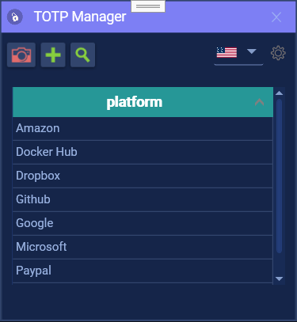
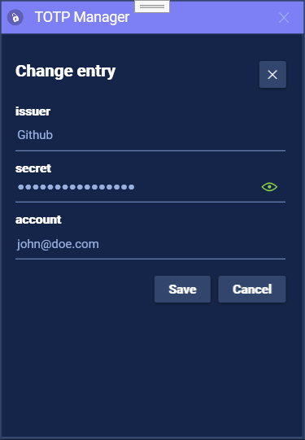
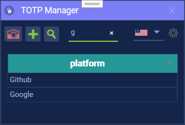
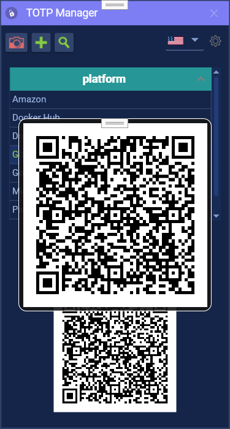

# TOTP Manager

[](https://github.com/Legends/TOTP-Manager)
[](https://dotnet.microsoft.com/download/dotnet/9.0)
[](https://github.com/Legends/TOTP-Manager/actions/workflows/build-and-test.yml)
[](https://github.com/Legends/TOTP-Manager/actions/workflows/security-audit.yml)
[](https://github.com/Legends/TOTP-Manager/releases/latest)
[](LICENSE.txt)

TOTP Manager is a local-first Windows authenticator for managing and generating time-based one-time passwords. It provides an encrypted desktop vault, optional Windows Hello unlock, QR workflows, protected backup and restore, and signed update metadata without requiring a cloud account.

> **Project status:** Active development. Published versions currently use release-candidate (`-rc`) tags. Keep a tested encrypted backup before upgrading.

## Highlights

- Encrypted local vault protected by a master password
- Optional Windows Hello unlock, with the master password retained as the recovery method
- Manual account entry and `otpauth://` QR-code scanning
- Rotating TOTP display with click-to-copy and configurable clipboard clearing
- Automatic locking on idle timeout and Windows session lock
- Encrypted `.totp` import and export with conflict handling
- Local backup rotation and signed automatic-update metadata
- English and German user-interface resources
- Native Windows WPF interface and single-instance behavior

TOTP Manager currently supports the standard configuration used by most providers: `SHA1`, 6 digits, and a 30-second period. These parameters are fixed rather than configurable per account.

## Screenshots

<p align="center">
  
</p>

<details>
  <summary>More screenshots</summary>
  <br />
  <table>
    <tr>
      <td align="center" width="33%">
        <br />
        <strong>Account list</strong>
      </td>
      <td align="center" width="33%">
        <br />
        <strong>QR-code generation</strong>
      </td>
      <td align="center" width="33%">
        <br />
        <strong>Account editor</strong>
      </td>
    </tr>
    <tr>
      <td align="center" width="33%">
        <br />
        <strong>Issuer search</strong>
      </td>
      <td align="center" width="33%">
        <br />
        <strong>QR-code preview</strong>
      </td>
      <td align="center" width="33%"></td>
    </tr>
  </table>
</details>

## Install

TOTP Manager supports 64-bit Windows 10 and Windows 11. Download the latest package from [GitHub Releases](https://github.com/Legends/TOTP-Manager/releases/latest):

| Package | Runtime requirement | Recommended for |
| --- | --- | --- |
| `TOTP-Manager-portable.zip` | None; the .NET runtime is included | Most users and portable use |
| `TOTP-Manager-fast.zip` | [.NET 9 Desktop Runtime (x64)](https://dotnet.microsoft.com/download/dotnet/9.0) | Smaller installation and faster startup |

Extract the selected archive to a local folder, start `TOTP.UI.WPF.exe`, and complete the first-run master-password setup. The .NET **SDK** is only required when building the project from source.

## Basic usage

- Add an account manually with its issuer, account label, and Base32 secret, or scan a compatible `otpauth://` QR code with the camera workflow.
- Select an account to display and copy its current code. Clicking the displayed code copies it again.
- Search filters the account list by issuer.
- Edit or delete an account from its context menu; `Ctrl+A` opens account creation and `Ctrl+E` edits the selected account.
- Generate a QR code for an existing account when transferring it to another compatible authenticator.

Treat QR codes, copied OTPs, and exported data as secrets. Anyone who obtains an account seed can generate valid codes.

## Security model

TOTP Manager is designed to keep authentication data local and encrypted at rest:

- Vault data is protected with authenticated AES-256-GCM encryption.
- Master-password key derivation uses Argon2id.
- Decrypted key material is kept in memory only while the vault is unlocked and is cleared where practical.
- Windows Hello can provide a device-bound fast unlock path; it does not replace the master password for recovery and portability.
- Clipboard auto-clear, idle locking, session-lock handling, and secret hiding are enabled by default and configurable in Settings.
- Automatic-update metadata is authenticated with Ed25519 appcast signatures.

Appcast signing protects the update feed and is separate from Windows Authenticode signing of release executables. For design assumptions, limitations, and verification evidence, see:

- [Threat model](docs/security/THREAT_MODEL.md)
- [Security verification](docs/security/SECURITY_VERIFICATION.md)
- [Penetration-test plan](docs/security/PENTEST_PLAN.md)
- [Automatic-update design](docs/security/AUTO_UPDATE.md)

To report a suspected vulnerability, follow the private reporting instructions in [SECURITY.md](SECURITY.md). Do not include secrets or exploit details in a public issue.

## Data, backup, and recovery

Application data is stored under `%APPDATA%\TOTP-Manager` by default, including the encrypted account vault (`master.totp`) and protected settings (`settings.totp`).

- Create an encrypted `.totp` export for migration and disaster recovery.
- Store backup files separately from the computer and test the restore procedure periodically.
- Preserve the export password; an encrypted export cannot be recovered without it.
- Keep the master password available even when Windows Hello is enabled.
- Automatic local backup rotation protects against some local file failures, but it is not a substitute for an external encrypted backup.
- Plaintext interoperability exports require additional care and should be deleted securely when no longer needed.

## Automatic updates

Update checks are enabled by default and run at startup. TOTP Manager validates signed appcast metadata before accepting update information. Update behavior can be changed in the application settings.

Release and update-feed maintainers should follow the [auto-update setup guide](docs/security/AUTO_UPDATE.md) and must never commit private signing material.

## Build from source

Development requires Windows, Git, and the [.NET 9 SDK](https://dotnet.microsoft.com/download/dotnet/9.0).

```powershell
git clone https://github.com/Legends/TOTP-Manager.git
cd TOTP-Manager
dotnet restore TOTP.sln --configfile NuGet.config
dotnet build TOTP.sln -c Debug
dotnet run --project .\TOTP\TOTP.UI.WPF.csproj
```

Run the complete test suite with:

```powershell
dotnet test TOTP.sln -c Debug
```

For the faster PR-style subset after a Release build:

```powershell
dotnet test TOTP.sln -c Release --no-build --filter "FullyQualifiedName!~Integration&FullyQualifiedName!~IdleMonitoringBackgroundServiceTests&FullyQualifiedName!~UserActivityServiceTests"
```

## Repository layout

| Project | Responsibility |
| --- | --- |
| `TOTP.Core` | Domain models, contracts, validation, and security abstractions |
| `TOTP.Infrastructure` | Security, account, export, settings, logging, and OS-facing implementations |
| `TOTP.DAL` | Encrypted persistence and filesystem data access |
| `TOTP` | WPF views, view models, workflows, startup, and dependency composition |
| `TOTP.Tests` | Unit, regression, integration, and security-adjacent tests |
| `TOTP.Updater` | Update and installation support UI |
| `scripts` | Release, security, and local update-testing automation |
| `docs/security` | Threat model, verification evidence, and release-security guidance |

The application follows MVVM, dependency injection, and explicit layer boundaries. See [CONTRIBUTING.md](CONTRIBUTING.md) before making changes.

## Contributing and support

Contributions that preserve the project's local-first and security-first direction are welcome. Use [GitHub Issues](https://github.com/Legends/TOTP-Manager/issues) for reproducible bugs and focused feature requests, and review the [contribution guide](CONTRIBUTING.md) for build, testing, and pull-request expectations.

Security vulnerabilities must be reported privately according to [SECURITY.md](SECURITY.md).

## License

TOTP Manager is distributed under the terms in [LICENSE.txt](LICENSE.txt). Third-party components and attributions are documented in [THIRD_PARTY_NOTICES.md](THIRD_PARTY_NOTICES.md).
